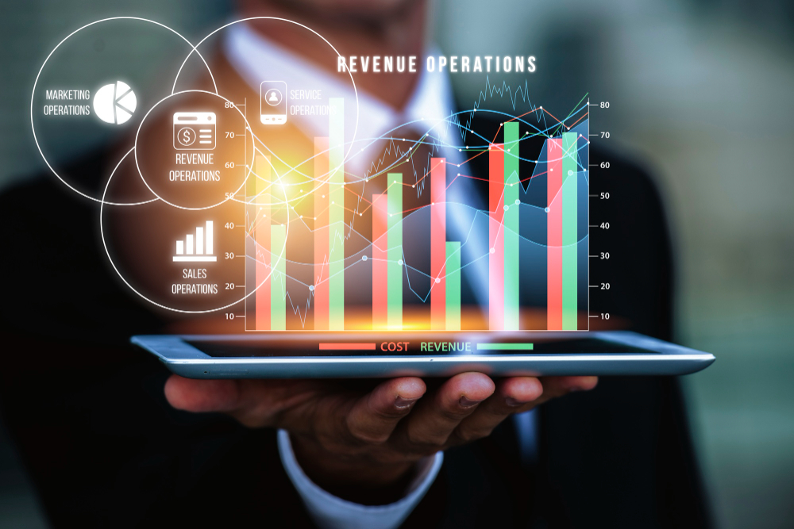

# Microsoft-Financial-Report
This report contains a detailed overview of financial performance, position, and cash flows during the specified period. The image below is gotten from [feepiks](https://www.freepik.com/free-photo/revenue-operations-concept_74741055.htm#page=2&query=financial%20dashboard&position=49&from_view=search&track=ais&uuid=87a6ef6d-3b44-4c88-83ad-b3d74c549e99)

## Introduction
The objective of preparing this financial report is to provide a clear, accurate, and comprehensive overview of the organization's financial performance. This financial report provide stakeholders with accurate and transparent insights into the financial health and performance of the organization and it's analyzed on Microsoft Excel. It will serve as a crucial tool for accountability and effective communication, fostering trust and confidence among stakeholders.

## Problem Statement
The goal is to provide answers to the following questions:
* What is the overall revenue generated by the software company?
* What is the cost of revenue by Quarter and the gross margin after deducting the associated costs?
* How much is unearned revenue for productivity and business processes, intelligent cloud and more personal computing.
* Calculate the net income, operating income and income before tax.

## Data Source
The data used for this work is gotten from DahelTechies Internship Program.

*Disclaimer:* This is not a real company's dataset.

## Skills and Concepts Demonstrated
Microsoft Excel Concepts like:
* Data Entry and Formatting
* Advanced Formula Proficiency
* Cell Referencing
* Form Controls
* Interactive Charts and Graphs
* Conditional Formatting for Interactivity
* Income Statement Components
* Hyperlinks and Navigation

## Data Transformation
Before I begin, I made sure I understood the structure and content of the dataset. I Identified the data relevant to income, such as revenue, expenses, net income, and the date column. 

Clean the data by correcting data types and ensuring consistency.

* Dataset Preview

 ## Data Analysis
I Created a new table to store relevant data in regards to the report and used form control to allow users select specific quarter and year.

Here, I did alot of complex Excel formulas and functions to perform dynamic calculations to derive financial metrics.

I implemented absolute and relative cell references to ensure accurate formula calculations and copying across cells.

I generated various types of charts (bar charts, line graphs, pie charts) to visually represent financial trends and comparisons

* Analysis

  
## Data Visualizations
Here, I moved my analysis to my dashboard page.

Created charts and graphs that respond dynamically to selections, enhancing visual representation and analysis.

I incorporated form controls for interactivity to help user select a specific quarter and year.

Used hyperlinks and created navigation buttons to allow users to move seamlessly between different sheets within workbook.

Finally, I arrived at a report with three (3) pages named:
* Cover Page
* Dashboard Page 
* Analysis Page
  
## Features of the report
The cover table shows the title of the report, the financial period (Jan 2016 - 2nd Quarter of 2022) and navigation buttons to direct you to other pages. The dashboard page shows the details of the income statement using the dropdown button to select the quarter and year. It has the navigation buttons too. The analysis page has both the dataset and the summary of the income statement.
* Cover Page

* Dashboard

* Analysis page:
This page shows the calculations and working of the incomes before moving it to the dashboard page. Here, the figures are shown in a table format.

## Summary
* Unearned revenue for productivity and business processes, intelligent cloud and more personal computing are $14,077, $12984 and $3336 with the percentage of 46%, 43% and 11% respectively.
* Capital expenditure (in billions), revenue (in millions), total cost of revenue (in million) and net income (in millions) are shown in regards to the quarter and year selected from the drop-down list.
* Gross margin, operating income, income before tax and other income are represented on column chart with their respective amount right on top of each column

## Recommendations
* The company should monitor and manage cash flows closely, considering the significant of capital expenditure and to also ensure that expansions should not strain liquidity but have a sustainable impact on the organization's financial health.
* The organization should explore strategic partnerships and collaborations to share the burden of capital expenditure as the amount spent only on capital expenditure is huge 
* Also, prioritize investments based on strategic alignment, market potential, and long-term growth prospects to enhance capabilities

## Thank you for reading
I’m open to any data roles
